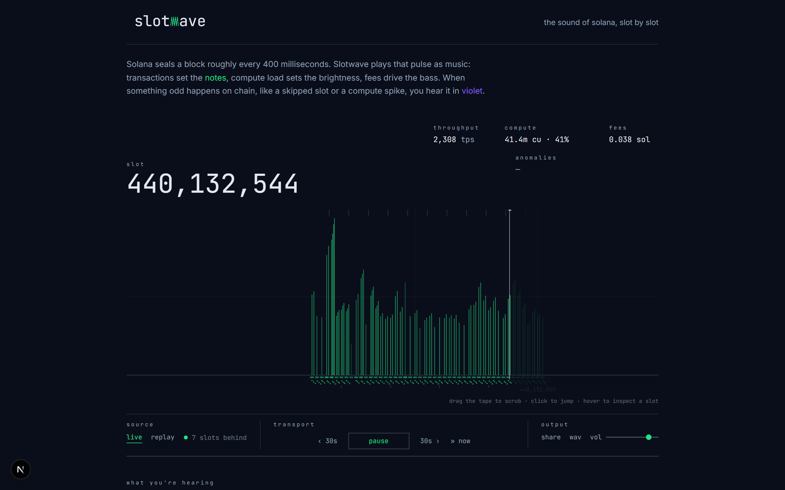

# Slotwave



Real-time Solana sonification. Slots stream in, from a recorded capture or
live mainnet, a pure mutation engine maps chain activity to musical
parameters, Tone.js plays them, and a flat canvas timeline pulses in sync.

**green = normal flow · violet = anomalous events** (skipped slots, compute-unit
spikes). The semantic is identical in audio timbre and UI color.

## Run

```bash
npm install
npm run dev     # http://localhost:3000, replay mode works with no setup
npm test        # pure /lib unit tests (vitest)
npm run e2e     # browser smoke test (dev server must be running;
                # set CHROME_PATH if Chrome lives somewhere unusual)
npm run build
```

Press **start** (or space). Replay mode loops the JSONL fixture in
`public/data/`. Live mode needs an RPC key (below); without one it falls back
to replay automatically.

The instrument is a tape: every ingested slot is mapped to sound exactly once
and kept in a session buffer, so you can **pause**, **rewind 30s**, **click
the tape to seek**, and **hover any tick** to inspect that slot's data. In
live mode the buffer keeps recording while you listen to the past.

## Live mode

Copy `.env.example` to `.env.local` (or `.env`) and set a Solana RPC URL that
includes your provider key. Any JSON-RPC provider works — the app speaks raw
JSON-RPC with no provider SDK — e.g. Alchemy:

```
SOLANA_RPC_URL=https://solana-mainnet.g.alchemy.com/v2/YOUR_KEY
```

The key never reaches the client. Route handlers proxy the RPC with closed,
validated params:

- `GET /api/tip` returns the finalized tip slot, `s-maxage=3`
- `GET /api/window/[start]` returns 8 consecutive `SlotRecord`s with
  `s-maxage=31536000, immutable`. Starts must be multiples of 8, so every
  listener asks for identical URLs and each stretch of chain hits the origin
  exactly once. Windows that are not fully finalized return 404 `no-store`.
- `GET /api/slot/[slot]` returns one finalized `SlotRecord`, same caching

The player anchors the tip every 12 seconds and extrapolates it locally in
between (the server's 404 on non-finalized windows makes optimism safe), then
pulls windows a few at a time. While paused it keeps recording up to about 2
minutes of tape, then the fetcher idles (it also idles in a hidden tab that is
not playing), so an abandoned browser stops burning RPC quota.

Every window fetched from the provider is archived to `.cache/slotwave/`
(gitignored): dev restarts and re-listens of the same slots never cost another
call. Turn the archive into a replay tape with
`npx tsx scripts/export-archive.ts`.

## The mappings

Pure modules in `lib/` (no React, no Tone.js):

- **density**, tx count → 1–4 notes per slot on an E minor pentatonic ladder
- **pressure**, compute-unit utilization opens a lowpass filter; fees drive velocity
- **bass**, total fees → the ground note under each slot
- **texture**, failed-transaction share → deterministic noise grains
- **anomaly**, skipped slot → FM thud; CU z-score > 2.5 → metallic burst (event voice)

Stats are exponentially-weighted over a 64-slot window, so mappings react to
relative change on any fixture or network condition.

## Scripts

```bash
npx tsx scripts/gen-fixture.ts   # regenerate the synthetic fixture
npx tsx scripts/capture.ts --slots 1000   # record a real mainnet fixture
                                          # (reads SOLANA_RPC_URL / .env.local)
```

## Deploy (Vercel)

Import the repo, set `SOLANA_RPC_URL` in the project's environment variables,
deploy. No `vercel.json` needed, the CDN honors the routes' `s-maxage`
headers (check `x-vercel-cache: HIT` on repeated `/api/window/[start]`
requests). Production defaults to live mode with automatic replay fallback.

When serving a custom domain, also set `NEXT_PUBLIC_SITE_URL` to it (e.g.
`https://slotwave.example.com`) and redeploy: the domain Vercel auto-detects
is baked at build time, and the Farcaster manifest signature must match the
final domain exactly.

## Tuning the mix

Open the app with `?debug=1` to get per-voice volume sliders plus the room
reverb amount. Changes apply live and persist in the browser; "copy mix" puts
the numbers on your clipboard.

## Farcaster mini app

The app ships as a Farcaster Mini App: manifest at
`/.well-known/farcaster.json`, `fc:miniapp` embed tags (a shared `/?slot=N`
link opens the app landing on that slot), and the SDK handshake
(`ready()`; sharing composes a cast inside Farcaster clients).

After deploying, three manual steps remain:

1. Sign the `accountAssociation` for your production domain with the manifest
   tool at `https://farcaster.xyz/~/developers/mini-apps/manifest` (the domain
   must match exactly) and add the generated `{ header, payload, signature }`
   to `app/.well-known/farcaster.json/route.ts`.
2. Test with the preview tool:
   `https://farcaster.xyz/~/developers/mini-apps/preview?url=<encoded-url>`
   (check audio starts after the tap on a real phone).
3. Publish to the catalog.

## Font license

The bundled JetBrains Mono font (`app/og-font.ttf`, used to render the social
card) is licensed under the SIL Open Font License 1.1, included as
`app/og-font-LICENSE.txt`.
